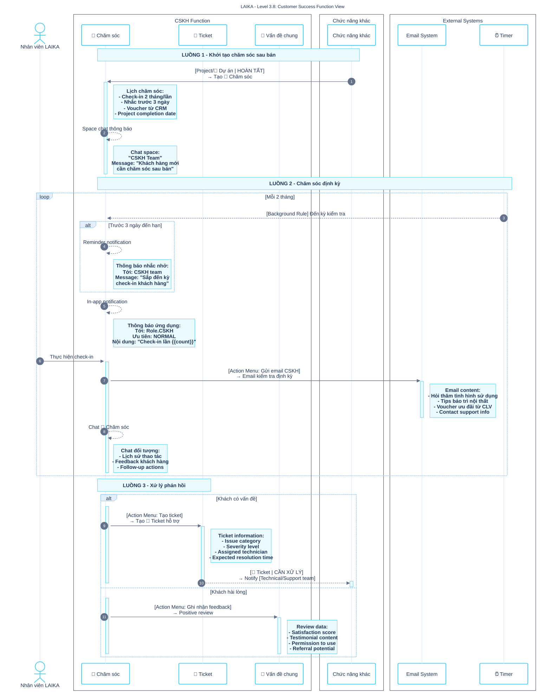

# LAIKA - BẢN THIẾT KẾ CẤU HÌNH TOÀN CỤC LUKLAK

**Tên Doanh nghiệp:** LAIKA Design & Build\
**Mã Doanh nghiệp (Business Key):** LAIKA\
**Phạm vi tài liệu:** Cấu hình cấp Toàn cục (Global) và Khu vực (Area) trong nền tảng Luklak


---

## PHẦN 1: CẤU TRÚC & ĐIỀU HƯỚNG TOÀN CỤC

### 1.1 CẤU TRÚC TỔ CHỨC THỐNG NHẤT

#### Sơ đồ tổ chức (Organization Tree)

```expandable
LAIKA (Doanh nghiệp/Organization)
│
├── 🏢 KINH DOANH (Khu vực/Area)
│   ├── 📍 Marketing Campaigns (Mảng việc/Space)
│   │   └── 📋 Marketing Function
│   │       ├── 🧊 Chiến dịch Marketing
│   │       └── 🧊 Lead từ Quảng cáo
│   └── 📍 Sales & CRM (Mảng việc/Space)
│       └── 📋 CRM & Sales Function
│           ├── 🧊 Khách hàng
│           └── 🧊 Lịch hẹn Tư vấn
│
├── 🏢 KẾ TOÁN (Khu vực/Area)
│   └── 📍 Contract & Invoice (Mảng việc/Space)
│       └── 📋 Contract & Invoice Function
│           └── 🧊 Hợp đồng
│               └── 🧊︎ Phiếu thu (Sub-object)
│
├── 🏢 THIẾT KẾ - THI CÔNG (Khu vực/Area)
│   └── 📍 Product Delivery Management (Mảng việc/Space)
│       └── 📋 Product Delivery Function
│           ├── 🧊 Dự án
│           ├── 🧊 Khảo sát
│           └── 🧊 Thiết kế
│               ├── 🧊︎ Concept (Sub-object)
│               └── 🧊︎ Bản vẽ Thi công (Sub-object)
│
└── 🏢 CSKH (Khu vực/Area)
    └── 📍 Customer Success (Mảng việc/Space)
        └── 📋 Customer Success Function
            ├── 🧊 Chăm sóc sau bán
            └── 🧊 Customer Support
```

### 1.2 PHÒNG LÀM VIỆC (WORKSPACES)

| Tên Workspace            | Mục đích                                        | Thành viên/Vai trò (Global Roles)                                                               | Items bao gồm                                                                                                                             |
| :----------------------- | :---------------------------------------------- | :---------------------------------------------------------------------------------------------- | :---------------------------------------------------------------------------------------------------------------------------------------- |
| **Leadership Dashboard** | Tổng quan điều hành và ra quyết định chiến lược | - Admin: CEO, CFO\<br\>- Member: COO                                                            | - Cross-Function Dashboard: Company Performance\<br\>- Cross-Function Dashboard: Customer Journey Analytics\<br\>- Folder: VẬN HÀNH CHUNG |
| **Operations Hub**       | Điều phối hoạt động giữa các phòng ban          | - Manager: Tất cả Department Heads\<br\>- Member: Cross-function Coordinators                   | - Cross-Function Dashboard: Pipeline Overview\<br\>- Cross-Function Dashboard: Resource Allocation\<br\>- Folder: TẤT CẢ ĐẦU VIỆC         |
| **Front Office**         | Vận hành Marketing và Sales                     | - Manager: Sales Manager, Marketing Manager\<br\>- Member: Sales Team, Marketing Team           | - Folder: MARKETING\<br\>- Folder: KINH DOANH\<br\>- Cross-Function Filter: Hot Prospects Today                                           |
| **Back Office**          | Quản lý vận hành và tài chính                   | - Manager: CFO, Project Director\<br\>- Member: Accounting Team, Design Team, Construction Team | - Folder: KẾ TOÁN\<br\>- Folder: THIẾT KẾ & THI CÔNG\<br\>- Cross-Function Dashboard: Cash Flow Analysis                                  |
| **Customer Care**        | Chăm sóc và hỗ trợ khách hàng                   | - Manager: Customer Success Manager\<br\>- Member: Customer Success Team                        | - Folder: CSKH\<br\>- Cross-Function Filter: VIP Customer Activities                                                                      |

### 1.3 THƯ MỤC (FOLDERS)

| Tên Folder              | Mục đích                                      | Items bao gồm                                                                                                                                                                                    |
| :---------------------- | :-------------------------------------------- | :----------------------------------------------------------------------------------------------------------------------------------------------------------------------------------------------- |
| **TẤT CẢ ĐẦU VIỆC**     | Xem tổng thể mọi hoạt động xuyên doanh nghiệp | - Filter: All Overdue Items\<br\>- Filter: High Priority Cross-Function\<br\>- Dashboard: Resource Allocation Report                                                                             |
| **VẬN HÀNH CHUNG**      | Điều phối hoạt động xuyên chức năng           | - Filter: Hot Prospects Today\<br\>- Filter: At-Risk Revenue Pipeline\<br\>- Dashboard: Company Performance\<br\>- Automation: Daily Lead Distribution\<br\>- Automation: Weekly Pipeline Review |
| **MARKETING**           | Quản lý hoạt động Marketing                   | - Links to: Marketing Campaigns Space\<br\>- Filter: High-Value Leads This Week                                                                                                                  |
| **KINH DOANH**          | Quản lý hoạt động Sales                       | - Links to: Sales & CRM Space\<br\>- Filter: Closing This Month                                                                                                                                  |
| **THIẾT KẾ & THI CÔNG** | Quản lý dự án                                 | - Links to: Product Delivery Management Space\<br\>- Filter: Projects Starting This Week                                                                                                         |
| **CSKH**                | Quản lý chăm sóc khách hàng                   | - Links to: Customer Success Space\<br\>- Filter: Customer Health Check Due                                                                                                                      |
| **KẾ TOÁN**             | Quản lý tài chính                             | - Links to: Contract & Invoice Space\<br\>- Filter: Overdue Payments                                                                                                                             |

---

## PHẦN 2: DỮ LIỆU & MỐI QUAN HỆ TOÀN CỤC (Global Admin Settings)

### 2.1 KẾT NỐI ĐỐI TƯỢNG TOÀN CỤC (Global Object Connections)

_Cài đặt tại: Admin Toàn cục \> Kết nối Loại việc_

| Tên kết nối           | Object 1 (Function A)                       | Object 2 (Function B)                             | Mô tả chiều vào (Inward)          | Mô tả chiều ra (Outward)   |
| :-------------------- | :------------------------------------------ | :------------------------------------------------ | :-------------------------------- | :------------------------- |
| **Lead-to-Customer**  | Lead từ Quảng cáo\<br\>(Marketing Function) | Khách hàng\<br\>(CRM & Sales Function)            | "Khách hàng được convert từ Lead" | "Lead nguồn gốc"           |
| **Customer-Contract** | Khách hàng\<br\>(CRM & Sales Function)      | Hợp đồng\<br\>(Contract & Invoice Function)       | "Hợp đồng của khách hàng"         | "Khách hàng ký kết"        |
| **Contract-Project**  | Hợp đồng\<br\>(Contract & Invoice Function) | Dự án\<br\>(Product Delivery Function)            | "Dự án triển khai từ hợp đồng"    | "Hợp đồng nguồn"           |
| **Project-Survey**    | Dự án\<br\>(Product Delivery Function)      | Khảo sát\<br\>(Product Delivery Function)         | "Khảo sát thuộc dự án"            | "Dự án được khảo sát"      |
| **Project-Design**    | Dự án\<br\>(Product Delivery Function)      | Thiết kế\<br\>(Product Delivery Function)         | "Thiết kế cho dự án"              | "Dự án cần thiết kế"       |
| **Customer-Care**     | Khách hàng\<br\>(CRM & Sales Function)      | Chăm sóc sau bán\<br\>(Customer Success Function) | "Hoạt động CSKH của khách hàng"   | "Khách hàng được chăm sóc" |

### 2.2 TRƯỜNG DÙNG CHUNG (Shared Fields)

_Cài đặt tại: Admin Toàn cục \> Trường dữ liệu_

| Tên trường                            | Loại trường                                                            | Mục đích                                               | Functions sử dụng                                                                                                           |
| :------------------------------------ | :--------------------------------------------------------------------- | :----------------------------------------------------- | :-------------------------------------------------------------------------------------------------------------------------- |
| **Tham chiếu Khách hàng**             | Trường chọn Đầu việc (Object Reference)                                | Đảm bảo tham chiếu khách hàng nhất quán xuyên hệ thống | - CRM & Sales Function\<br\>- Contract & Invoice Function\<br\>- Product Delivery Function\<br\>- Customer Success Function |
| **Mã Dự án**                          | Trường văn bản (Text Field)                                            | Mã định danh duy nhất cho dự án                        | - Contract & Invoice Function\<br\>- Product Delivery Function                                                              |
| **Giá trị vòng đời khách hàng (CLV)** | Trường số (Number Field)                                               | Theo dõi tổng giá trị khách hàng                       | - CRM & Sales Function\<br\>- Customer Success Function                                                                     |
| **UTM nguồn Lead**                    | Trường văn bản (Text Field)                                            | Theo dõi nguồn gốc marketing                           | - Marketing Function\<br\>- CRM & Sales Function                                                                            |
| **Trạng thái thanh toán**             | Sổ xuống chọn một (Single Select)                                      | Theo dõi tình trạng thanh toán                         | - Contract & Invoice Function\<br\>- Product Delivery Function                                                              |
| **Độ ưu tiên khách hàng**             | Sổ xuống chọn một (Single Select)\<br\>Options: VIP, Premium, Standard | Phân loại mức độ chăm sóc                              | - CRM & Sales Function\<br\>- Customer Success Function                                                                     |

---

## PHẦN 3: LUỒNG TỰ ĐỘNG HOÁ & TÍCH HỢP XUYÊN CHỨC NĂNG

### 3.1 LUỒNG TỰ ĐỘNG HOÁ CHÍNH (Chronological Narrative)

#### **Chuỗi 1: Marketing → Sales (Lead Generation & Conversion)**

```
[Marketing Function]                    [CRM & Sales Function]
Lead từ Quảng cáo                      Khách hàng
     |                                      ^
     |--[CHUYỂN CRM]----------------------->|
            |                               |
            |--[Auto-assign Sales]--------->|
            |                               |
            |--[Welcome Email]------------->|
```

**Luồng chi tiết:**

1. Khi Lead từ Quảng cáo chuyển sang trạng thái CHUYỂN CRM → Trigger cross-function automation
2. Tự động tạo Khách hàng mới trong CRM & Sales Function với trạng thái NEW LEAD
3. Phân công Sales dựa trên routing rules (ngân sách \>500tr → Senior Sales)
4. Gửi welcome email sequence qua external integration

#### **Chuỗi 2: Sales → Contract (Deal Closing)**

```
[CRM & Sales Function]              [Contract & Invoice Function]
Khách hàng                         Hợp đồng
     |                                 ^
     |--[SOẠN HỢP ĐỒNG]-------------->|
            |                          |
            |--[Create Calendar]------>|
            |                          |
            |--[Pre-survey]----------->|
```

**Luồng chi tiết:**

1. Khách hàng chuyển TƯ VẤN → Tạo Google Calendar meeting
2. Khách hàng chuyển SOẠN HỢP ĐỒNG → Tạo Hợp đồng draft trong Contract Function
3. Đồng thời tạo pre-project Khảo sát trong Product Delivery

#### **Chuỗi 3: Contract → Project (Project Initiation)**

```
[Contract & Invoice Function]       [Product Delivery Function]
Hợp đồng/Phiếu thu                 Dự án
     |                                 ^
     |--[KÝ KẾT]--------------------->|
     |                                 |
     |--[Phiếu thu ĐÃ THU]---------->|
```

**Luồng chi tiết:**

1. Hợp đồng KÝ KẾT → Auto-create 3 Phiếu thu (25%, 40%, 35%)
2. Phiếu thu Đợt 1 ĐÃ THU → Activate Dự án, unlock resources
3. Notification to internal chat về payment success

#### **Chuỗi 4: Project → Customer Success (Post-Delivery)**

```
[Product Delivery Function]         [Customer Success Function]
Dự án                              Chăm sóc sau bán
     |                                 ^
     |--[HOÀN TẤT]------------------>|
            |                          |
            |--[Update CLV]----------->|
            |                          |
            |--[Upsell opportunity]-->|
```

### 3.2 QUY TẮC TỰ ĐỘNG HOÁ (By Type)

#### 3.2.1 Workflow Rules - Cross-Functional (ORANGE flows)

_Loại: Quy tắc trên Luồng tiến trình - Trigger từ status change_

| Rule # | Tên quy tắc                 | Function nguồn & Trigger                  | Hành động (Target Function)                  | Smart Values                                                       |
| :----- | :-------------------------- | :---------------------------------------- | :------------------------------------------- | :----------------------------------------------------------------- |
| CF-W01 | Lead to Customer Conversion | Marketing: Lead từ Quảng cáo / CHUYỂN CRM | Create: Khách hàng in CRM (NEW LEAD)         | `{trigger.ho_ten}`, `{trigger.email}`, `{trigger.campaign_source}` |
| CF-W02 | Contract Creation from Deal | CRM: Khách hàng / SOẠN HỢP ĐỒNG           | Create: Hợp đồng in Contract (SOẠN THẢO)     | Customer ref = `{trigger.key}`, Value = `{trigger.ngan_sach}`      |
| CF-W03 | Project Activation          | Contract: Hợp đồng / KÝ KẾT               | Create: Dự án in Product Delivery (PLANNING) | Contract ref = `{trigger.key}`, Budget = `{trigger.gia_tri}`       |
| CF-W04 | Payment Unlock Project      | Contract: Phiếu thu Đợt 1 / ĐÃ THU        | Update: Dự án in Product Delivery → KICK OFF | Unlock budget, assign PM                                           |
| CF-W05 | Project Completion Care     | Product Delivery: Dự án / HOÀN TẤT        | Create: Chăm sóc sau bán in Customer Success | Schedule \+60 days check-in                                        |

#### 3.2.2 Action on Object Rules - Cross-Functional (BLUE flows)

_Loại: Hành động trên Đầu việc - Manual trigger_

| Rule # | Tên quy tắc           | Function nguồn & Menu Action               | Hành động (Target Function)               | Điều kiện              |
| :----- | :-------------------- | :----------------------------------------- | :---------------------------------------- | :--------------------- |
| CF-A01 | Generate Contract     | CRM: Khách hàng / "Tạo hợp đồng"           | Create: Hợp đồng với template             | Status = TƯ VẤN XONG   |
| CF-A02 | Request Design Update | Contract: Hợp đồng / "Yêu cầu thiết kế"    | Create: Thiết kế task in Product Delivery | Contract signed = true |
| CF-A03 | Escalate to Support   | Product Delivery: Dự án / "Escalate issue" | Create: Customer Support ticket           | Priority = High        |

#### 3.2.3 Background Rules - Global/Scheduled (GREEN flows)

_Loại: Quy tắc chạy ngầm - Scheduled hoặc system trigger_

| Rule # | Tên quy tắc              | Lịch trình         | Hành động                                       | Phạm vi                   |
| :----- | :----------------------- | :----------------- | :---------------------------------------------- | :------------------------ |
| CF-B01 | Daily Lead Distribution  | Hàng ngày 8:00 AM  | Phân bổ unassigned leads theo workload          | Folder: VẬN HÀNH CHUNG    |
| CF-B02 | Weekly Pipeline Review   | Thứ 2 9:00 AM      | Tổng hợp & gửi báo cáo pipeline                 | Folder: VẬN HÀNH CHUNG    |
| CF-B03 | Monthly Customer Health  | Ngày 1 hàng tháng  | Tạo care tasks cho completed projects \>60 ngày | Area: CSKH                |
| CF-B04 | Overdue Payment Alert    | Hàng ngày 10:00 AM | Alert về payments quá hạn \>7 ngày              | Area: KẾ TOÁN             |
| CF-B05 | Project Deadline Warning | Hàng ngày 6:00 PM  | Notify về projects deadline \<7 ngày            | Area: THIẾT KẾ - THI CÔNG |

### 3.3 TÍCH HỢP ỨNG DỤNG BÊN NGOÀI (External App Integrations)

#### 3.3.1 Google Workspace Integration

| Integration          | Trigger từ Luklak                  | External Action                       | Response về Luklak                 | Cài đặt tại            |
| :------------------- | :--------------------------------- | :------------------------------------ | :--------------------------------- | :--------------------- |
| **Calendar Meeting** | CRM: Lịch hẹn Tư vấn / ĐẶT LỊCH    | Create Calendar event với attendees   | Update meeting link trong Lịch hẹn | Automation Rule CF-E01 |
| **Docs Contract**    | Contract: Hợp đồng / GỬI KHÁCH     | Generate từ template với merge fields | Return document URL                | Automation Rule CF-E02 |
| **Drive Folders**    | Product Delivery: Dự án / KICK OFF | Create project folder structure       | Return folder URLs                 | Automation Rule CF-E03 |

#### 3.3.2 Sepay Payment Integration

| Integration          | Trigger từ Luklak             | External Action                   | Response về Luklak             | Cài đặt tại            |
| :------------------- | :---------------------------- | :-------------------------------- | :----------------------------- | :--------------------- |
| **QR Generator**     | Contract: Phiếu thu / CẦN THU | Generate payment QR với reference | Return QR image URL            | Automation Rule CF-E04 |
| **Payment Webhook**  | Webhook endpoint              | Sepay sends transaction data      | Auto-update Phiếu thu / ĐÃ THU | Webhook Rule CF-E05    |
| **Transaction Sync** | Daily 11:00 PM                | Query pending transactions        | Update payment statuses        | Background Rule CF-E06 |

#### 3.3.3 Communication Integrations

| Integration            | Trigger từ Luklak                    | External Action           | Response về Luklak            | Cài đặt tại            |
| :--------------------- | :----------------------------------- | :------------------------ | :---------------------------- | :--------------------- |
| **Email Sequences**    | Marketing: Lead / CHUYỂN CRM         | Send welcome email series | Track open/click rates        | Automation Rule CF-E07 |
| **SMS Reminders**      | Contract: Phiếu thu overdue \>3 days | Send payment reminder SMS | Log SMS sent status           | Background Rule CF-E08 |
| **VOIP Click-to-Call** | Any Object: Menu "Call"              | Initiate VOIP call        | Log call duration & recording | Action Rule CF-E09     |
| **Zalo ZNS**           | Contract: Send invoice notification  | Send ZNS với template     | Track delivery status         | Automation Rule CF-E10 |

---

## PHẦN 4: QUẢN LÝ NGƯỜI DÙNG & KIỂM SOÁT TRUY CẬP TOÀN CỤC

### 4.1 NHÓM NGƯỜI DÙNG (Directory Groups)

_Cài đặt tại: Danh bạ \> Nhóm_

| Tên nhóm                  | Mô tả                | Thành viên                                                                       | Vai trò mặc định |
| :------------------------ | :------------------- | :------------------------------------------------------------------------------- | :--------------- |
| **Leadership**            | Ban lãnh đạo cấp cao | CEO, COO, CFO                                                                    | Admin            |
| **Department Heads**      | Trưởng các phòng ban | Sales Manager, Marketing Manager, CFO, Design Director, Customer Success Manager | Manager          |
| **Marketing Team**        | Nhân viên marketing  | Marketing Executives, Content Creators                                           | Member           |
| **Sales Team**            | Nhân viên kinh doanh | Senior Sales, Junior Sales                                                       | Member           |
| **Accounting Team**       | Nhân viên kế toán    | Chief Accountant, Accounting Staff                                               | Member           |
| **Design Team**           | Nhân viên thiết kế   | Lead Designer, Designers                                                         | Member           |
| **Construction Team**     | Nhân viên thi công   | Project Managers, Site Supervisors                                               | Member           |
| **Customer Success Team** | Nhân viên CSKH       | CS Managers, Support Staff                                                       | Member           |

### 4.2 VAI TRÒ TOÀN CỤC (Global Roles)

_Cài đặt tại: Admin Toàn cục \> Vai trò_

| Vai trò                        | Mô tả                     | Quyền cơ bản                                                                                           | Áp dụng cho           |
| :----------------------------- | :------------------------ | :----------------------------------------------------------------------------------------------------- | :-------------------- |
| **Admin**                      | Quản trị hệ thống         | - Full system access\<br\>- Manage users & groups\<br\>- Configure global settings                     | Leadership group      |
| **Manager**                    | Quản lý phòng ban         | - Full function access within department\<br\>- View cross-function reports\<br\>- Manage team members | Department Heads      |
| **Member**                     | Nhân viên                 | - Access assigned functions\<br\>- Update assigned objects\<br\>- View permitted reports               | All staff             |
| **Cross-Function Coordinator** | Điều phối xuyên chức năng | - Read all functions\<br\>- Update cross-function processes\<br\>- Manage integrations                 | Selected coordinators |

### 4.3 PHƯƠNG ÁN PHÂN QUYỀN & THÔNG BÁO TOÀN CỤC

_Cài đặt tại: Admin Toàn cục \> Phương án Phân quyền & Thông báo_

#### Phương án Phân quyền Toàn cục

| Tên phương án            | Mô tả                             | Cài đặt chi tiết                                                                             | Functions áp dụng                        |
| :----------------------- | :-------------------------------- | :------------------------------------------------------------------------------------------- | :--------------------------------------- |
| **Executive Overview**   | Quyền xem toàn diện cho lãnh đạo  | - View all: Admin role\<br\>- No edit on operational data\<br\>- Full access to reports      | All Functions - read only                |
| **Department Standard**  | Quyền chuẩn cho phòng ban         | - Full access: Manager role within department\<br\>- View only: Member role cross-department | Default for all Functions                |
| **Customer Data Access** | Quyền truy cập dữ liệu khách hàng | - View customer journey: All roles\<br\>- Edit customer data: Assigned staff only            | CRM, Contract, Product, Customer Success |

#### Phương án Thông báo Toàn cục

| Tên phương án              | Mô tả                                   | Quy tắc thông báo                                                                                                     | Functions áp dụng              |
| :------------------------- | :-------------------------------------- | :-------------------------------------------------------------------------------------------------------------------- | :----------------------------- |
| **High-Value Alerts**      | Thông báo cho giao dịch giá trị cao     | - Contract \>1B: Notify CEO, CFO\<br\>- Payment received \>100M: Notify CFO\<br\>- Project delayed: Notify COO        | Contract, Product Delivery     |
| **Cross-Function Updates** | Thông báo cập nhật xuyên chức năng      | - Status changes affecting other departments\<br\>- Notify: Next function owner \+ manager                            | All cross-function connections |
| **Customer Critical**      | Thông báo sự kiện quan trọng khách hàng | - Complaints: Immediate to CS Manager\<br\>- Escalations: CEO \+ Department Head\<br\>- VIP activities: Account owner | All Functions                  |

---

## KIỂM TRA CUỐI CÙNG - NGUYÊN TẮC MECE

### Xác nhận phân tách cấu hình

✅ **Cấu hình Toàn cục (Tài liệu này):**

- Cấu trúc tổ chức (Organization, Areas)
- Workspaces & Folders
- Global Object Connections
- Shared Fields
- Cross-Function Automations
- External Integrations
- Global Roles & Permissions

✅ **Cấu hình Function (Tài liệu riêng):**

- Object types trong Function
- Workflows & statuses
- Fields specific to function
- Within-function automations
- Function-specific roles
- Default workviews & dashboards

### Tổng kết cài đặt toàn cục

| Loại cấu hình              | Số lượng | Vị trí cài đặt            |
| :------------------------- | :------- | :------------------------ |
| Areas                      | 4        | Organization Settings     |
| Workspaces                 | 5        | Workspace Management      |
| Folders                    | 7        | Folder Management         |
| Global Object Connections  | 6        | Admin Toàn cục \> Kết nối |
| Shared Fields              | 6        | Admin Toàn cục \> Trường  |
| Cross-Function Automations | 25       | Folder/Area Automation    |
| External Integrations      | 12       | Integration Settings      |
| Global Roles               | 4        | Admin Toàn cục \> Vai trò |
| Groups                     | 8        | Danh bạ \> Nhóm           |

**Tài liệu này hoàn chỉnh và sẵn sàng để triển khai cấu hình toàn cục Luklak cho LAIKA.**

